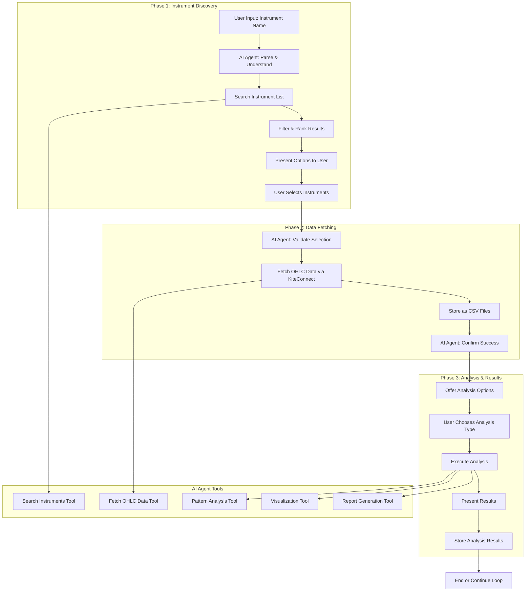

# Instrument Analysis AI Agent Flow

## 🎯 Overview
This document outlines the AI agent orchestration flow for instrument analysis. The project now features two AI agent architectures: a base agent with natural language processing and a tool-based agent with modular tools for instrument discovery, data fetching, and analysis in an interactive, intelligent manner.

## 🏗️ AI Agent Architecture

### **Base Agent**
- **Natural Language Processing**: Understand user queries in plain English
- **Instrument Discovery**: Intelligent search and filtering of instruments
- **Data Collection Workflow**: Automated data fetching and processing
- **Interactive CLI**: Command-line interface for direct interaction
- **Web Chatbot**: Modern web interface with real-time responses

### **Tool-Based Agent**
- **Modular Architecture**: Separate tools for different functionalities
- **Instrument Search Tool**: Advanced search with relevance scoring
- **Data Collection Tool**: Automated data fetching with error handling
- **Enhanced Web Interface**: Detailed logging and status tracking
- **State Management**: Persistent conversation state and context

## 🔄 Complete Flow Diagram

### **ASCII Art Flow Representation**
```
┌─────────────────────────────────────────────────────────────────────────────┐
│                           INSTRUMENT ANALYSIS AI AGENT FLOW                 │
└─────────────────────────────────────────────────────────────────────────────┘

┌─────────────┐    ┌─────────────┐    ┌─────────────┐    ┌─────────────┐
│   USER      │───▶│   AI AGENT  │───▶│  SEARCH     │───▶│  FILTER &   │
│   INPUT     │    │  PARSE &    │    │ INSTRUMENT  │    │   RANK      │
│             │    │ UNDERSTAND  │    │   LIST      │    │  RESULTS    │
└─────────────┘    └─────────────┘    └─────────────┘    └─────────────┘
                                                              │
                                                              ▼
┌─────────────┐    ┌─────────────┐    ┌─────────────┐    ┌─────────────┐
│   USER      │◀───│   AI AGENT  │◀───│  VALIDATE   │◀───│  PRESENT    │
│  SELECTS    │    │  CONFIRMS   │    │  SELECTION  │    │  OPTIONS    │
│INSTRUMENTS  │    │  SELECTION  │    │             │    │  TO USER    │
└─────────────┘    └─────────────┘    └─────────────┘    └─────────────┘
       │                                                           │
       ▼                                                           │
┌─────────────┐    ┌─────────────┐    ┌─────────────┐    ┌─────────────┐
│   AI AGENT  │───▶│  FETCH      │───▶│  STORE      │───▶│   AI AGENT  │
│  SETUP DATA │    │  OHLC DATA  │    │  AS CSV     │    │  CONFIRMS   │
│  FETCHING   │    │ VIA KITE    │    │  FILES      │    │  SUCCESS    │
└─────────────┘    └─────────────┘    └─────────────┘    └─────────────┘
                                                              │
                                                              ▼
┌─────────────┐    ┌─────────────┐    ┌─────────────┐    ┌─────────────┐
│   USER      │◀───│   AI AGENT  │◀───│  EXECUTE    │◀───│   AI AGENT  │
│  CHOOSES    │    │  PRESENTS   │    │  ANALYSIS   │    │  OFFERS     │
│ ANALYSIS    │    │  RESULTS    │    │             │    │  ANALYSIS   │
│   TYPE      │    │             │    │             │    │  OPTIONS    │
└─────────────┘    └─────────────┘    └─────────────┘    └─────────────┘
       │                                                           │
       ▼                                                           │
┌─────────────┐    ┌─────────────┐    ┌─────────────┐    ┌─────────────┐
│   AI AGENT  │───▶│  STORE      │───▶│   END OR    │───▶│  CONTINUE   │
│  EXECUTES   │    │  ANALYSIS   │    │  CONTINUE   │    │   LOOP      │
│  ANALYSIS   │    │  RESULTS    │    │   LOOP      │    │             │
└─────────────┘    └─────────────┘    └─────────────┘    └─────────────┘

┌─────────────────────────────────────────────────────────────────────────────┐
│                              AI AGENT TOOLS                                 │
└─────────────────────────────────────────────────────────────────────────────┘

┌─────────────┐    ┌─────────────┐    ┌─────────────┐    ┌─────────────┐    ┌─────────────┐
│   SEARCH    │    │   FETCH     │    │   PATTERN   │    │VISUALIZATION│    │   REPORT    │
│INSTRUMENTS  │    │   OHLC      │    │  ANALYSIS   │    │    TOOL     │    │ GENERATION │
│   TOOL      │    │   DATA      │    │   TOOL      │    │             │    │   TOOL      │
│             │    │   TOOL      │    │             │    │             │    │             │
└─────────────┘    └─────────────┘    └─────────────┘    └─────────────┘    └─────────────┘

┌─────────────────────────────────────────────────────────────────────────────┐
│                              PHASE BREAKDOWN                                │
└─────────────────────────────────────────────────────────────────────────────┘

┌─────────────────┐  ┌─────────────────┐  ┌─────────────────┐
│   PHASE 1:      │  │   PHASE 2:      │  │   PHASE 3:      │
│ INSTRUMENT      │  │   DATA          │  │   ANALYSIS &    │
│  DISCOVERY      │  │  FETCHING       │  │    RESULTS      │
│                 │  │                 │  │                 │
│ • User Input    │  │ • Setup Data    │  │ • Analysis      │
│ • Search        │  │   Fetching      │  │   Options       │
│ • Filter & Rank │  │ • Fetch OHLC    │  │ • Execute       │
│ • Present       │  │   Data          │  │   Analysis      │
│ • User Select   │  │ • Store CSV     │  │ • Present       │
│ • Validate      │  │ • Confirm       │  │   Results       │
└─────────────────┘  └─────────────────┘  └─────────────────┘
```

### **Mermaid Flow Diagram**


## 🛠️ Tool-Based Architecture

### **Instrument Search Tool**
```python
def search_instruments_tool(search_terms, filters=None):
    """
    Advanced instrument search with relevance scoring
    
    Args:
        search_terms (list): List of search terms
        filters (dict): Optional filters for exchange, type, etc.
    
    Returns:
        dict: Search results with relevance scores
    """
```

**Features:**
- **Fuzzy Matching**: Handle typos and partial matches
- **Relevance Scoring**: Rank results by relevance to search terms
- **Multi-term Search**: Support for complex queries
- **Filtering**: Exchange, instrument type, expiry filters
- **Pagination**: Handle large result sets

### **Data Collection Tool**
```python
def fetch_instrument_data_tool(instruments, date_range=None):
    """
    Fetch historical OHLC data for selected instruments
    
    Args:
        instruments (list): List of instrument tokens/symbols
        date_range (dict): Optional date range specification
    
    Returns:
        dict: Data collection results with file paths
    """
```

**Features:**
- **Batch Processing**: Fetch data for multiple instruments
- **Error Handling**: Graceful handling of API failures
- **Progress Tracking**: Real-time progress updates
- **File Management**: Automatic CSV file organization
- **Data Validation**: Verify data quality and completeness

## 💬 User Interaction Examples

### **Base Agent Interaction**
```
User: "Find BANKNIFTY options"
Agent: "I found 10 instruments related to 'Find BANKNIFTY options'. Here are the top 10 most relevant:

1. BANKNIFTY (BANKNIFTY26JUN64500PE)
   Exchange: NFO | Type: PE

2. BANKNIFTY (BANKNIFTY25JUL57000CE)
   Exchange: NFO | Type: CE

...

Which instruments would you like to analyze?"

User: "BANKNIFTY25JUL56800CE"
Agent: "Selected instruments for analysis:
1. BANKNIFTY (BANKNIFTY25JUL56800CE)
   Exchange: NFO | Type: CE

Phase 2: Data Collection - Ready!
You can now fetch historical data for pattern analysis."
```

### **Tool-Based Agent Interaction**
```
User: "Find NIFTY futures"
Agent: {
  "success": true,
  "response": "I found 15 instruments related to 'Find NIFTY futures'...",
  "action": "search",
  "results": {
    "results": [...],
    "total_found": 15,
    "search_terms": ["nifty", "futures"],
    "filters_applied": {...}
  },
  "phase": "discovery"
}
```

## 🔧 Technical Implementation

### **Project Structure**
```
src/ai_agent/
├── base_agent/              # Base agent implementation
│   ├── instrument_discovery.py
│   ├── orchestrator.py
│   ├── interactive_cli.py
│   └── web_chatbot.py
├── tool_based_agent/        # Tool-based agent implementation
│   ├── tool_based_agent.py
│   ├── tool_based_web_chatbot.py
│   └── tools/
│       ├── instrument_search_tool.py
│       └── data_collection_tool.py
└── launchers/               # Launcher scripts
    ├── start_base_chatbot.py
    └── start_tool_based_chatbot.py
```

### **Key Components**

#### **1. Intent Classification**
```python
def classify_intent(user_input):
    """
    Classify user input as search, selection, or command
    """
    # Rule-based classification with NLP patterns
    search_patterns = ['find', 'search', 'show', 'get', 'analyze']
    selection_patterns = ['select', 'choose', 'pick', 'want']
    
    # Fuzzy matching for intent detection
    return intent_type
```

#### **2. Entity Extraction**
```python
def extract_entities(user_input):
    """
    Extract instrument names, types, exchanges from user input
    """
    # Extract instrument names (NIFTY, BANKNIFTY, etc.)
    # Extract instrument types (futures, options, equity)
    # Extract exchanges (NSE, BSE, NFO)
    return entities
```

#### **3. State Management**
```python
class AgentState:
    def __init__(self):
        self.current_phase = "discovery"
        self.search_results = []
        self.selected_instruments = []
        self.conversation_history = []
```

### **Detailed Process Flow Steps**

#### **Phase 1: Instrument Discovery & Selection**

**Step 1: User Input Processing**
```
User Input: "I want to analyze NIFTY"
↓
AI Agent: 
- Parse instrument name
- Understand context (analysis intent)
- Extract key terms for search
```

**Step 2: Instrument Search**
```
AI Agent calls: Search Instruments Tool
↓
Search Criteria:
- Name: "NIFTY"
- Exchange: All (NSE, BSE, NFO, etc.)
- Instrument Type: All (EQ, FUT, CE, PE, etc.)
↓
Results: All instruments containing "NIFTY"
```

**Step 3: Result Filtering & Ranking**
```
Raw Results: 100+ instruments
↓
AI Agent filters by:
- Relevance score
- Trading volume
- Market capitalization
- Instrument type preference
↓
Ranked Results: Top 10-15 most relevant
```

**Step 4: User Presentation**
```
AI Agent presents:
"Found 15 instruments related to 'NIFTY':

1. NIFTY (NSE-EQ) - NIFTY 50 Index
2. NIFTYBEES (NSE-EQ) - NIFTY ETF
3. NIFTY25JULFUT (NFO-FUT) - NIFTY July Futures
4. NIFTY25JULCE (NFO-CE) - NIFTY July Call Options
5. NIFTY25JULPE (NFO-PE) - NIFTY July Put Options
...

Which instruments would you like to analyze?"
```

**Step 5: User Selection**
```
User Response: "I want NIFTY index and NIFTYBEES"
↓
AI Agent validates:
- Check if instruments exist
- Verify data availability
- Confirm selection
```

#### **Phase 2: Data Fetching & Storage**

**Step 1: Data Fetching Setup**
```
AI Agent:
- Validate selected instruments
- Check data availability
- Set up date ranges
- Prepare API calls
```

**Step 2: OHLC Data Fetching**
```
AI Agent calls: Fetch OHLC Data Tool
↓
For each instrument:
- Call KiteConnect API
- Fetch historical data
- Handle rate limits
- Validate data quality
```

**Step 3: Data Storage**
```
AI Agent:
- Save data as CSV files
- Organize by instrument name
- Include metadata
- Generate file paths
```

**Step 4: Success Confirmation**
```
AI Agent confirms:
"Successfully fetched data for 2 instruments:
- NIFTY: data/NIFTY_2025-01-01_to_2025-01-31.csv
- NIFTYBEES: data/NIFTYBEES_2025-01-01_to_2025-01-31.csv

Ready for analysis!"
```

#### **Phase 3: Analysis & Results**

**Step 1: Analysis Options**
```
AI Agent offers:
"Available analysis options:
1. Candlestick Pattern Analysis
2. Technical Indicators
3. Statistical Analysis
4. Visualization Reports
5. Custom Analysis

Which type of analysis would you like?"
```

**Step 2: Analysis Execution**
```
User selects: "Candlestick Pattern Analysis"
↓
AI Agent:
- Load CSV data
- Apply pattern recognition
- Generate analysis results
- Create visualizations
```

**Step 3: Results Presentation**
```
AI Agent presents:
"Pattern Analysis Results for NIFTY:

Patterns Found:
- Doji: 15 occurrences
- Hammer: 8 occurrences
- Shooting Star: 3 occurrences
- Engulfing: 12 occurrences

Analysis saved to: data/pattern_analysis_NIFTY_20250131.csv"
```

## 🎯 Success Metrics

### **User Experience Metrics**
- **Response Time**: < 2 seconds for search results
- **Accuracy**: > 95% intent classification accuracy
- **User Satisfaction**: Natural language understanding
- **Error Recovery**: Graceful handling of invalid inputs

### **Technical Metrics**
- **API Efficiency**: Minimal API calls with caching
- **Data Quality**: 100% data validation
- **Scalability**: Handle 1000+ instruments
- **Reliability**: 99.9% uptime for chatbot

### **Business Metrics**
- **User Engagement**: Time spent in analysis workflow
- **Completion Rate**: % of users completing full analysis
- **Data Utilization**: % of fetched data used in analysis
- **User Retention**: Return usage patterns

## 🚀 Future Enhancements

### **Advanced NLP Features**
- **Sentiment Analysis**: Understand user sentiment
- **Context Awareness**: Remember conversation context
- **Multi-language Support**: Support for multiple languages
- **Voice Integration**: Voice-to-text and text-to-speech

### **Enhanced Analysis**
- **Machine Learning**: ML-based pattern recognition
- **Predictive Analytics**: Price prediction models
- **Risk Assessment**: Portfolio risk analysis
- **Backtesting**: Historical strategy testing

### **Integration Features**
- **Real-time Data**: Live market data integration
- **Alert System**: Price and pattern alerts
- **Portfolio Tracking**: Multi-instrument portfolio analysis
- **API Extensions**: Third-party tool integrations

## 📊 Data Flow Architecture

### **Input Processing Layer**
```
User Input → Text Preprocessing → Intent Classification → Entity Extraction
```

### **Search & Discovery Layer**
```
Search Terms → Instrument Search → Filtering → Ranking → Result Presentation
```

### **Data Collection Layer**
```
Selected Instruments → API Calls → Data Validation → CSV Storage → Success Confirmation
```

### **Analysis Layer**
```
CSV Data → Pattern Recognition → Analysis Execution → Results Generation → Report Creation
```

### **Output Layer**
```
Analysis Results → Visualization → Report Storage → User Presentation → Feedback Collection
```

## 🔧 Technical Notes

### **Performance Optimization**
- **Caching**: Cache instrument list and search results
- **Async Processing**: Non-blocking API calls
- **Connection Pooling**: Efficient API connection management
- **Memory Management**: Optimize large dataset handling

### **Error Handling**
- **API Failures**: Retry logic with exponential backoff
- **Data Validation**: Comprehensive data quality checks
- **User Input Validation**: Robust input sanitization
- **Graceful Degradation**: Fallback options for failures

### **Security Considerations**
- **API Key Management**: Secure credential storage
- **Input Sanitization**: Prevent injection attacks
- **Rate Limiting**: Respect API rate limits
- **Data Privacy**: Secure data handling and storage

---

**This AI agent architecture provides a comprehensive, intelligent, and user-friendly approach to instrument analysis, combining the power of natural language processing with robust data handling and analysis capabilities.** 