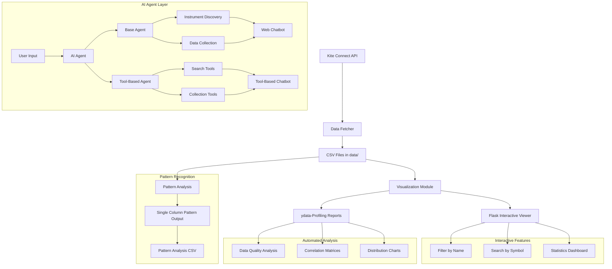

# NIFTY Candlestick Pattern Tester

This project analyzes NIFTY and other instrument candlestick patterns using the Kite Connect API. It supports robust data fetching, token management, SHA-256 hashing, CSV export, comprehensive visualization tools, AI-powered instrument analysis, and detailed analysis with both interactive web interfaces and automated reports.

## 📒 NIFTY Data Analysis Workflow (New!)

A new workflow module is available under `src/workflow/`:

- `nifty_data_analysis.py`: End-to-end script for fetching, analyzing, and reporting NIFTY daily candle data and patterns.
- `nifty_data_analysis.ipynb`: Jupyter notebook version for interactive, step-by-step analysis and visualization.

**Features:**
- Robust path handling for config and data directories.
- Improved error handling for notebook and script execution.
- Compatible with both project root and workflow directory execution.

### How to Run the Notebook

# source candle-pattern-test/bin/activate

From the project root:
```bash
cd /path/to/candle-pattern-test/candle-pattern-test
jupyter notebook src/workflow/nifty_data_analysis.ipynb
```

### Data Fetcher Improvements

- `src/data_fetcher.py` now loads configuration only when a fetcher instance is created, not at import time. This prevents import errors in Jupyter and improves modularity.

### Troubleshooting

- **Import errors in notebook:** Always start Jupyter from the project root.
- **FileNotFoundError for config:** Ensure `config/local-settings.json` exists and is accessible from the current working directory.
- **Column name errors:** The workflow now auto-detects column names for robust plotting and reporting.

---

## 🚀 Features
- **Data Fetching**: Fetch historical OHLC (Open, High, Low, Close) data for NIFTY and any instrument on Kite Connect
- **Automatic Token Management**: Automatic token refresh and validation for Kite Connect API
- **SHA-256 Authentication**: Secure API authentication with SHA-256 hash generation
- **CSV Export**: Save fetched data as CSV files in the `data/` folder
- **Instrument List Management**: Fetch and export the complete instrument list from Kite Connect
- **Multi-Instrument Support**: Fetch daily candles for a configurable list of instruments
- **📊 Advanced Visualization**: Interactive web-based CSV viewer with filtering and search
- **📈 Data Profiling**: Automated ydata-profiling reports for comprehensive data analysis
- **🔍 Pattern Analysis**: Candlestick pattern recognition with single-column output
- **🤖 AI-Powered Analysis**: Intelligent instrument discovery and data collection workflows
- **🛠️ Tool-Based Architecture**: Modular tools for instrument search and data collection
- **💬 Interactive Chatbots**: Web-based and CLI interfaces for natural language interaction
- **📝 Comprehensive Logging**: Detailed logging to `logs/data_fetcher.log`
- **🧪 Extensive Testing**: Comprehensive test suite with examples
- **🎯 One-off Analysis**: Run pattern analysis on any CSV file

## 📁 Project Structure
```
candle-pattern-test/
├── config/
│   ├── local-settings.json     # Kite Connect API configuration
│   └── instrumentlist.json     # List of instruments to fetch daily candles for
├── data/                       # All fetched CSV data and reports
│   ├── *.csv                   # Historical data files
│   ├── *_profile.html          # ydata-profiling reports
│   └── pattern_analysis_*.csv  # Pattern analysis results
├── logs/
│   └── data_fetcher.log        # Log file for all data fetching operations
├── src/
│   ├── ai_agent/               # 🤖 AI Agent Modules
│   │   ├── base_agent/         # Base agent implementation
│   │   │   ├── __init__.py
│   │   │   ├── instrument_discovery.py
│   │   │   ├── orchestrator.py
│   │   │   ├── interactive_cli.py
│   │   │   └── web_chatbot.py
│   │   ├── tool_based_agent/   # Tool-based agent implementation
│   │   │   ├── __init__.py
│   │   │   ├── tool_based_agent.py
│   │   │   ├── tool_based_web_chatbot.py
│   │   │   └── tools/
│   │   │       ├── __init__.py
│   │   │       ├── instrument_search_tool.py
│   │   │       └── data_collection_tool.py
│   │   └── launchers/          # Launcher scripts
│   │       ├── __init__.py
│   │       ├── start_base_chatbot.py
│   │       └── start_tool_based_chatbot.py
│   ├── auth/                   # Token management and authentication
│   ├── examples/               # Example scripts
│   ├── visualize/              # 📊 Visualization module
│   │   ├── __init__.py
│   │   ├── unified_csv_viewer.py      # Combined Flask + ydata-profiling viewer
│   │   ├── generate_profile_report.py # Standalone ydata-profiling generator
│   │   └── visualize_csv_profile.py   # Original Flask interactive viewer
│   ├── candlestick_patterns.py
│   ├── data_fetcher.py         # Main data fetching logic
│   └── utils.py
├── tests/                      # Test suite
│   ├── test_ai_agent.py        # AI agent tests
│   ├── test_tool_based_agent.py # Tool-based agent tests
│   ├── test_data_fetcher.py    # Data fetcher tests
│   ├── test_candlestick_patterns.py # Pattern analysis tests
│   └── test_restructured_agents.py # Comprehensive agent tests
├── requirements.txt
└── README.md
```

## 🔄 Data Flow Diagram



## 🤖 AI Agent Features

### **Base Agent**
- **Natural Language Processing**: Understand user queries in plain English
- **Instrument Discovery**: Intelligent search and filtering of instruments
- **Data Collection Workflow**: Automated data fetching and processing
- **Interactive CLI**: Command-line interface for direct interaction
- **Web Chatbot**: Modern web interface with real-time responses

### **Tool-Based Agent**
- **Modular Architecture**: Separate tools for different functionalities
- **Instrument Search Tool**: Advanced search with relevance scoring
- **Data Collection Tool**: Automated data fetching with error handling
- **Enhanced Web Interface**: Detailed logging and status tracking
- **State Management**: Persistent conversation state and context

### **Usage Examples**
```bash
# Start base agent chatbot
python src/ai_agent/launchers/start_base_chatbot.py

# Start tool-based agent chatbot
python src/ai_agent/launchers/start_tool_based_chatbot.py

# Interactive CLI
python src/ai_agent/base_agent/interactive_cli.py
```

**Sample Interactions:**
```
User: "Find BANKNIFTY options"
Agent: "I found 10 instruments related to 'Find BANKNIFTY options'..."

User: "BANKNIFTY25JUL56800CE"
Agent: "Selected instruments for analysis: BANKNIFTY (BANKNIFTY25JUL56800CE)"
```

## 🎯 Visualization Features

### **📊 Unified CSV Viewer**
The main visualization tool that combines interactive web interface with automated data profiling:

```bash
# Start interactive viewer
python src/visualize/unified_csv_viewer.py data/instruments_list_20250705_093603.csv

# Generate profile report only
python src/visualize/unified_csv_viewer.py data/instruments_list_20250705_093603.csv --profile-only

# Use custom port
python src/visualize/unified_csv_viewer.py data/instruments_list_20250705_093603.csv --port 8080
```

**Features:**
- **🔍 Interactive Filtering**: Dropdown with 11,731+ unique instrument names
- **🔎 Real-time Search**: Search across trading symbols and names
- **📈 Live Statistics**: Total, filtered, and displayed record counts
- **📊 One-click Profiling**: Generate detailed ydata-profiling reports
- **📥 Data Export**: Download filtered CSV data
- **📱 Responsive Design**: Works on desktop and mobile browsers

### **📈 ydata-Profiling Reports**
Automated comprehensive data analysis reports:

```bash
# Generate standalone profile report
python src/visualize/generate_profile_report.py data/instruments_list_20250705_093603.csv

# With custom output name
python src/visualize/generate_profile_report.py data/instruments_list_20250705_093603.csv instrument_analysis
```

**Report Contents:**
- **📊 Overview**: Dataset summary and statistics
- **🔍 Variables**: Detailed analysis of each column
- **📈 Interactions**: Correlation between variables
- **⚠️ Missing Values**: Data quality analysis
- **📊 Distributions**: Histograms and charts
- **🔗 Correlations**: Heatmaps and relationships

## 🧪 Testing Instructions

### **1. Run All Tests**
```bash
# Run complete test suite
pytest

# Run with verbose output
pytest -v

# Run with coverage
pytest --cov=src
```

### **2. Test AI Agents**
```bash
# Test base agent
python -m pytest tests/test_ai_agent.py -v

# Test tool-based agent
python -m pytest tests/test_tool_based_agent.py -v

# Test comprehensive agent functionality
python -m pytest tests/test_restructured_agents.py -v
```

### **3. Test Data Fetcher**
```bash
# Test instrument list fetching
python -m pytest tests/test_data_fetcher.py::test_fetch_instrument_list -v

# Test historical candles
python -m pytest tests/test_data_fetcher.py::test_fetch_historical_candles -v

# Test daily candles for instruments
python -m pytest tests/test_data_fetcher.py::test_fetch_daily_candles_for_instruments -v
```

### **4. Test Visualization Module**
```bash
# Test unified viewer (requires CSV file)
python src/visualize/unified_csv_viewer.py data/instruments_list_20250705_093603.csv --profile-only

# Test standalone profile generator
python src/visualize/generate_profile_report.py data/instruments_list_20250705_093603.csv
```

### **5. Test Pattern Analysis**
```bash
# Test candlestick pattern recognition
python -m pytest tests/test_candlestick_patterns.py -v

# Test one-off pattern analysis
python src/examples/example_oneoff_pattern_analysis.py
```

### **6. Test Examples**
```bash
# Set PYTHONPATH for examples
export PYTHONPATH=$(pwd)

# Test instrument list example
python src/examples/example_instrument_list.py

# Test daily candles example
python src/examples/example_daily_candles.py

# Test pattern analysis example
python src/examples/example_pattern_analysis.py
```

## 🚀 Quick Start Guide

### **1. Setup Environment**
```bash
# Clone and setup
git clone <repository-url>
cd candle-pattern-test
python -m venv venv
source venv/bin/activate  # On Windows: venv\Scripts\activate
pip install -r requirements.txt
```

### **2. Configure API Credentials**
Create `config/local-settings.json`:
```json
{
  "kite_connect": {
    "api_key": "your_api_key",
    "api_secret": "your_api_secret",
    "access_token": "your_access_token",
    "nifty_instrument_token": 256265
  },
  "logging": {
    "level": "INFO",
    "file": "logs/data_fetcher.log"
  }
}
```

### **3. Fetch Instrument Data**
```bash
# Fetch complete instrument list
python src/examples/example_instrument_list.py

# Fetch daily candles for configured instruments
python src/examples/example_daily_candles.py
```

### **4. Start AI Chatbot**
```bash
# Start tool-based chatbot (recommended)
python src/ai_agent/launchers/start_tool_based_chatbot.py

# Start base chatbot
python src/ai_agent/launchers/start_base_chatbot.py

# Access at http://127.0.0.1:5001 (tool-based) or http://127.0.0.1:5002 (base)
```

### **5. Visualize Data**
```bash
# Start interactive viewer
python src/visualize/unified_csv_viewer.py data/instruments_list_20250705_093603.csv

# Access at http://127.0.0.1:5000
```

### **6. Run Pattern Analysis**
```bash
# Analyze patterns on NIFTY data
python src/examples/example_pattern_analysis.py

# One-off analysis on any CSV file
python src/examples/example_oneoff_pattern_analysis.py
```

## 📊 Example Outputs

### **CSV Files**
```
data/
├── instruments_list_20250705_093603.csv          # Complete instrument list
├── NIFTY_2025-05-29_to_2025-06-28_20250629_205543.csv
├── BANKNIFTY_2025-05-29_to_2025-06-28_20250629_205544.csv
├── RELIANCE_2025-05-29_to_2025-06-28_20250629_205547.csv
├── pattern_analysis_20250630_203801.csv          # Pattern analysis results
└── instruments_list_20250705_093603_profile.html # ydata-profiling report
```

### **Pattern Analysis Output**
```csv
date,open,high,low,close,volume,pattern
2025-06-28,19250.50,19300.25,19200.75,19275.30,1250000,"Doji,Spinning Top"
2025-06-27,19180.20,19250.80,19150.10,19220.45,1180000,"Hammer"
```

## 🔧 Configuration

### **Instrument List Configuration**
Edit `config/instrumentlist.json`:
```json
{
  "instruments": [
    { "name": "NIFTY", "description": "NIFTY 50 Index", "exchange": "NSE", "instrument_type": "EQ" },
    { "name": "BANKNIFTY", "description": "NIFTY Bank Index", "exchange": "NSE", "instrument_type": "EQ" },
    { "name": "INFY", "description": "Infosys Limited", "exchange": "NSE", "instrument_type": "EQ" },
    { "name": "RELIANCE", "description": "Reliance Industries Limited", "exchange": "NSE", "instrument_type": "EQ" }
  ],
  "default_settings": {
    "interval": "day",
    "save_csv": true,
    "date_format": "%Y-%m-%d"
  }
}
```

## 📝 Logging
All operations are logged to `logs/data_fetcher.log`:
- API calls and responses
- Token management events
- Data fetching operations
- Visualization generation
- Pattern analysis results
- AI agent interactions and workflows
- Errors and warnings

## 🎯 Use Cases

### **1. AI-Powered Analysis**
- Use natural language to search for instruments
- Automated data collection workflows
- Intelligent pattern recognition and analysis
- Interactive chatbot interfaces

### **2. Data Exploration**
- Use the interactive viewer to explore instrument data
- Filter by specific names (NIFTY, BANKNIFTY, etc.)
- Search for specific trading symbols
- Generate comprehensive data profiling reports

### **3. Pattern Analysis**
- Analyze candlestick patterns on historical data
- Run one-off analysis on any CSV file
- Export pattern results for further analysis

### **4. Research & Development**
- Test pattern recognition algorithms
- Validate data quality with profiling reports
- Explore correlations between variables
- Generate reproducible analysis workflows

## 🔍 Troubleshooting

### **Common Issues**

1. **Port Already in Use**
   ```bash
   # Use different port for visualization
   python src/visualize/unified_csv_viewer.py data/file.csv --port 8080
   
   # Use different port for chatbots
   # Edit the port in the launcher scripts
   ```

2. **ydata-profiling Import Error**
   ```bash
   # Install ydata-profiling
   pip install ydata-profiling
   ```

3. **API Authentication Issues**
   - Check `config/local-settings.json` credentials
   - Regenerate access token using `src/auth/token_generator.py`

4. **CSV File Not Found**
   - Ensure CSV file exists in `data/` directory
   - Check file permissions

5. **AI Agent Import Errors**
   ```bash
   # Set PYTHONPATH
   export PYTHONPATH=$(pwd)
   
   # Install missing dependencies
   pip install -r requirements.txt
   ```

## 🤝 Contributing

1. Fork the repository
2. Create a feature branch
3. Add tests for new functionality
4. Ensure all tests pass
5. Submit a pull request

## 📄 License

This project is licensed under the MIT License - see the LICENSE file for details.

## 🆕 Recent Changes

- Added robust NIFTY data analysis workflow (script + notebook)
- Improved compatibility for Jupyter and script execution
- Enhanced error handling and path management in data fetcher and workflow

---

**Happy Trading! 📈📊🤖** 